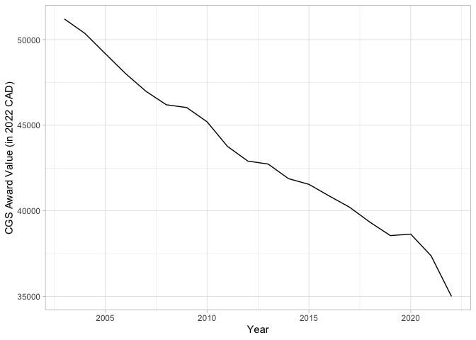
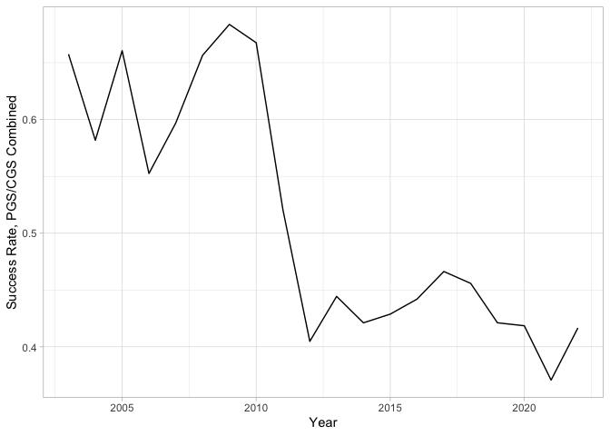
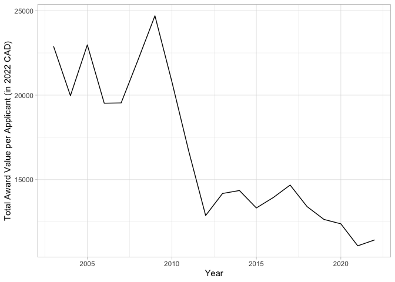
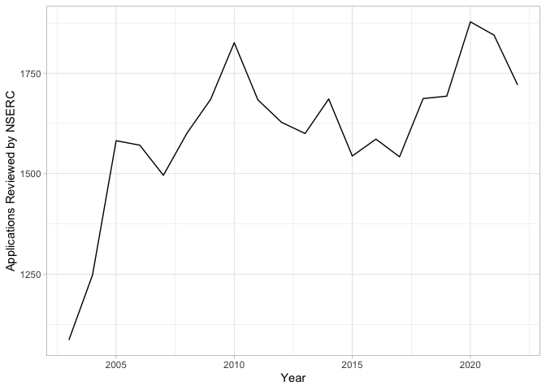
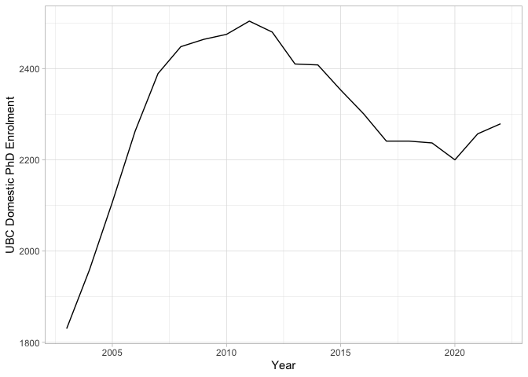
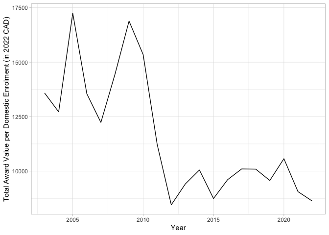

NSERC PGS/CGS-D Statistics
================

This document contains some very light exploratory analysis on the data.
There really is not much to analyze here, but if someone has better
ideas (or greater reach) than I do, my hope if that you find this data
somewhat useful. Starting with some extra low-hanging fruit…

<!-- -->

Success rates of applications took a steep decline around 2011-2012 from
\~60% to \~40%, and have stayed here ever since. Today, my personal
perspective is that the award is highly selective and prestigious,
though this appears to not always have been the case.

<!-- -->

There has been a proportional increase in the number of CGS awards
compared to PGS (which actually is good for retention, as the CGS needs
to be held at a Canadian institution, unlike the PGS). Despite this, the
increased selectivity and decreased real value means that the total
award value per applicant (“expected” award value for an average
applicant, if you will) has decreased sharply since 2003.

<!-- -->

Is the increased selectivity due to increased demand? Recall that NSERC
sets its own quota for each university, and so the number of
applications they review is largely set by themselves. Nonetheless,
there has been a moderate increase throughout the years.

<!-- -->

Is there underlying demand being suppressed by the quota? This is
unlikely, as least at UBC, where the number of domestic PhDs who would
be eligible for the award actually saw steady decline in the 2010’s.
Being a domestic PhD student in the highest CoL region in the country, I
am not entirely surprised.

<!-- -->

This decrease in enrolment means that it is actually possible to draw a
plot that makes it look like the expected (real) value of the PGS/CGS
program actually increased during the 2010s for UBC’s domestic PhDs.
Nice job!

<!-- -->
